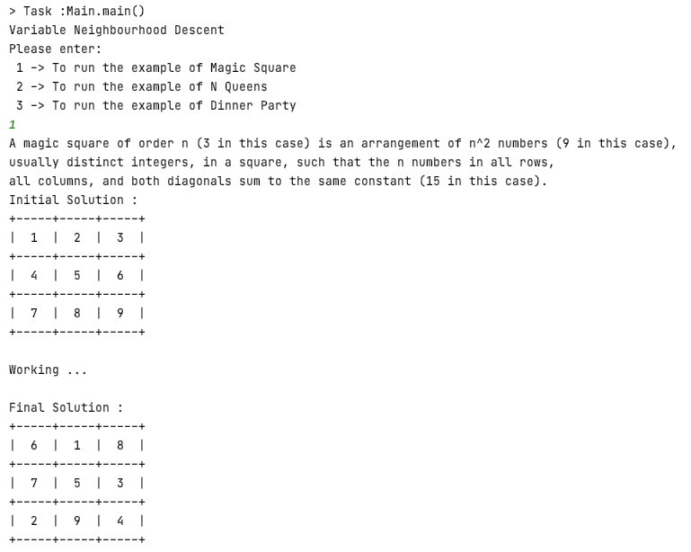

# VariableNeighbourhoodDescent
>A JAVA console application to simulate the Variable Neighbourhood Descent algorithm

## Built With

This project is built with :
* [JDK 8](https://www.oracle.com/java/technologies/javase/javase-jdk8-downloads.html)
* [ascii-table](https://github.com/freva/ascii-table)

## Description :

Variable Neighbourhood Descent Algorithm (VND) is a metaheuristic method for solving a set of problems and making the best solution :

## Examples :
1- N Queens problem :
We placed 4 chess queens on an 4×4 chessboard so that no two queens attack each other.

2- Dinner Party problem :
We invited 18 guests and prepared 3 round tables with 6 seats each.
1- Every guest should sit next to someone (left and right) of the opposite gender.
2- At every table, there should be one politician, one doctor, one socialite,
one coach, one teacher and one programmer.

3- Magic Square problem :
A magic square of order n (3 in this case) is an arrangement of n^2 numbers (9 in this case),
usually distinct integers, in a square, such that the n numbers in all rows,
all columns, and both diagonals sum to the same constant (15 in this case).

## How to run :
+ Install JDK 8 (https://www.oracle.com/java/technologies/javase/javase-jdk8-downloads.html)
+ Install IntelliJ IDEA (https://www.jetbrains.com/idea/)
+ Run the Main class (com.variable.neighbourhood.descent.Main)
+ Select an example

## Licence :
This project is licenced under the MIT licence : https://choosealicense.com/licenses/mit

## Contact :
Omar Sanad - omar.2019.sanad@gmail.com
Ghizlane Mardy - ghizlanemardy9@gmail.com
Salah Eddine Razik - raziksalah18@gmail.com
